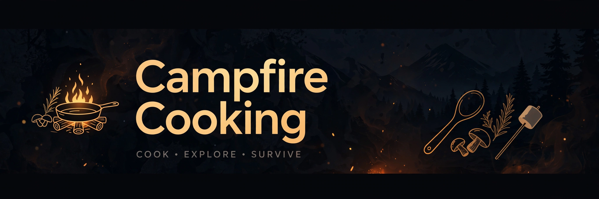

# Campfire Cooking — Living World Simulation

> 📖 The full game design document lives in [docs/DESIGN.md](docs/DESIGN.md).

> ## Status: 🟢 Completed
>
> <progress value="95" max="100"></progress>
>
> **Progress: 95%** — Simulation phases 1–8 complete (875/875 tests green); Unity visuals not yet started.

<p align="center">
  
</p>

  

## What it is

**Living World** is a pure-C# deterministic simulation of a living village — the backend heart of a planned Isekai Life RPG (third-person, iPad first). The core idea: the world exists independently of the player. NPCs have their own lives, animals behave, shops hold real inventories, towns grow and decline, and generations turn over — all ticked by a fixed-order simulation that can run faster than real time and is proven by automated tests, not graphics. A Unity presentation layer (player input, visuals) is planned but explicitly **not started**; the simulation is complete and playable as text-only scenario runs.

## What works (verified)

Verified by reading `docs/ROADMAP.md`, `docs/ARCHITECTURE.md`, the code tree, and GitHub Actions CI (all recent runs green):

- ✅ Design phase D-01–D-12 complete — world, locations, ~20 villagers, economy, items, skills, recipes, animals, knowledge, town, player start, all in `docs/design/` + JSON data in `Content/`
- ✅ Phase 0–1: foundation + "Apple Test" scenario (278 foundation tests)
- ✅ Phase 3: skills, crafting & cooking — skill levels 1–5, 21 recipes, cooking effects on town mood (639 tests)
- ✅ Phase 4: animal ecosystem & taming — 5 species, trust 0–100, predation, breeding, winter losses, wolf taming (697 tests)
- ✅ Phase 5: town development — 11 monthly stats, growth/decline migration, 10 emergent events (742 tests)
- ✅ Phase 6: multi-village — LOD state, trade routes, delayed/distorted news travel (787 tests)
- ✅ Phase 7: generations — 360-day calendar, aging, families, inheritance (875 tests)
- ✅ Phase 8: dialogue — immutable `FactSheet` builder + seeded deterministic template phrasing, read-only, never leaks secrets or changes state
- ✅ Save formats v1–v7 with load determinism proven per phase; CI runs `dotnet test SimulationTests` on every push

## Tech stack

| Layer | Technology |
|---|---|
| Simulation | C# / .NET 8, pure, no Unity dependencies |
| Package | `Packages/com.geltrax.livingworld.simulation` (Unity package layout, but Unity-free) |
| Tests | NUnit, scenario + acceptance runs with readable logs |
| CI | GitHub Actions — `dotnet tests` on every push/PR |
| Data | JSON content packs in `Content/` (world, NPCs, economy, recipes, animals) |

## How to run

The simulation is pure C# and needs **no Unity** to build or test. On the development Mac (verified 2026-10-03 with .NET 8 SDK):

```sh
dotnet test SimulationTests
dotnet test SimulationTests --configuration Release
```

In this sandbox, `dotnet test` can't run (the sandbox redirects localhost TCP, which breaks vstest↔testhost); use the custom runner instead:

```sh
~/workspace/run-sim-tests.sh
```

It builds `SimulationTests` and runs the full suite via a local FrameworkController runner. I did not re-run the suite in this audit — the latest CI runs (2026-10-04) are all **completed/success**.

## Screenshots

None — this is a text-only simulation; scenario runs produce readable event logs (see `docs/tasks/completed/` for run evidence). The banner above is the only visual.

## What you can add more

- [ ] **Unity presentation layer** — per the roadmap: visuals, controls, iPad/iPhone/Mac builds; the `Bridge` is the only code that touches both sim and Unity
- [ ] **Playable player loop** — player-driven commands (currently the world ticks itself)
- [ ] **Ratify the ~20 open questions** in `docs/OPEN_QUESTIONS.md` — `Death`/`Birth`/`Inheritance` event types, 360-day calendar, tavern-hearth recipes, "Oakhollow" name, wolf-bond pacing
- [ ] **Unity PlayMode tests** for the village tour (branches `task/U-00-*` exist with CI)
- [ ] Performance profiling of large runs (270-day / 5-year acceptances)

## Project structure

```
Campfire_Cooking/
├── Packages/com.geltrax.livingworld.simulation/  # Pure-C# simulation (WorldState, systems, RNG)
├── SimulationTests/                               # NUnit suite: Agents, Core, Economy, Knowledge,
│                                                  # Persistence, Scenarios, Tools (875 tests)
├── Content/                                       # JSON data packs: world, npcs, economy, items,
│                                                  # skills, recipes, animals, social, player
├── Assets/                                        # (Unity assets — currently unused)
├── docs/
│   ├── ROADMAP.md                                 # Phase checklist, all phases 1–8 DONE
│   ├── ARCHITECTURE.md                            # Sim/Unity/Bridge split
│   ├── DEVELOPMENT.md                             # Build & test commands
│   ├── OPEN_QUESTIONS.md                          # ~20 decisions awaiting human review
│   ├── design/                                    # D-01–D-12 design docs (WORLD, CHARACTERS, …)
│   └── tasks/                                     # Per-task briefs + completed run evidence
└── .github/workflows/                             # CI: dotnet tests on push/PR
```

---
*README written after code audit on 2026-10-08.*
